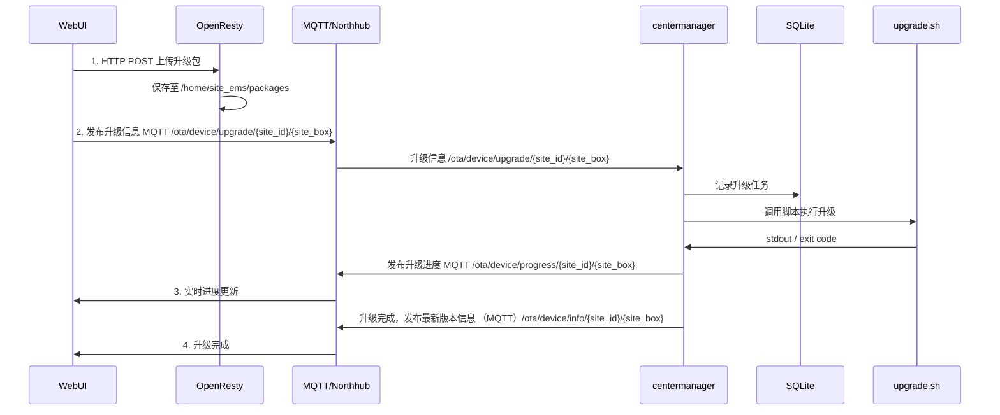
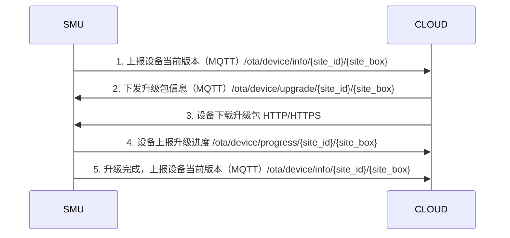
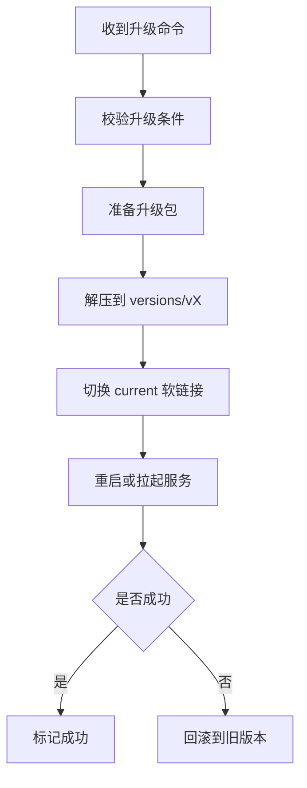

# SMU软件升级系统概要设计


## 1. 设计目标

### 1.1 功能目标
- 支持 Web UI 本地升级
- 支持 OTA 远程升级
- 支持 升级失败自动回滚
- 支持 升级进度实时展示
- 支持 异常重启后状态恢复
- 支持 数据库高版本向低版本兼容

### 1.2 非目标
- 不涉及 OS / Kernel / U-Boot 升级
- 不涉及数据库数据内容迁移（SQLite 数据不升级）
- 不涉及多设备批量升级策略（后续由云端批量升级或生产工具批量部署）


## 2. 系统背景与约束

- 系统：Ubuntu（嵌入式盒子）
- 后台服务管理：systemd
- 核心守护进程：centermanager（负责 watchdog 喂狗及内部进程守护）
- Web 服务：OpenResty
- 通信：
  - MQTT（支持 MQTT over WebSocket）
  - HTTP / HTTPS
- 本地持久化：SQLite
- 后续发布 **使用软链接管理软件版本**


## 3. 总体架构设计

### 3.1 架构原则
- 软件层与数据持久层分离
- 单一升级状态机
- 升级过程可中断、可恢复
- Web / OTA 复用同一升级引擎


### 3.2 组件职责

| 组件            | 职责              |
| ------------- | --------------- |
| Web UI        | 文件上传、升级控制、进度展示  |
| OpenResty     | HTTP 文件接收（仅此职责） |
| MQTT Broker / Northub  | 升级命令 & 状态通道     |
| centermanager | 升级控制、状态机、回滚     |
| upgrade.sh    | 升级执行、解压、切换      |
| SQLite        | 升级状态持久化         |


### 3.3 目录与版本管理设计

#### 3.3.1 基础目录结构
/home/siteems
├── current -> /home/siteems/versions/v1.2.1
├── versions/
│   ├── v1.2.0/
│   └── v1.2.1/
├── persistence/
│   └── site_ems.db
├── log/
└── package/


### 3.4 版本切换方式
- 使用 软链接 current 指向当前运行版本
- 升级通过 原子 ln -sfn 切换
- 回滚只需切换回旧版本


### 3.5 文件传输设计

#### 3.5.1 Web UI 本地升级（Push）

- Web UI → OpenResty
- HTTP POST 上传升级包
- 保存至：/home/siteems/packages/

#### 3.5.2 OTA 远程升级（Pull）

- 云端通过 MQTT 通知升级
- 盒子使用 HTTP GET 拉取升级包
- 支持断点续传与校验(to do)


### 3.6 升级时序图

#### 3.6.1 web ui升级



#### 3.6.2 云端OTA升级



#### 3.6.3 升级执行流程




### 3.7 通信报文

#### 3.7.1 MQTT

##### 1. 上报设备当前版本 topic: /ota/device/info/{site_id}/{site_box}

body:

```json
{
  "id": 1,
  "params": {
    "version": "2.0.0",
     "module": "default"
  }
}
```

参数说明：

| 参数    | 类型   | 说明                           |
| ------- | ------ | ------------------------------ |
| version | string | 版本号                         |
| module  | string | 模块名，暂时不填，默认全量升级 |


##### 2. 下发升级包信息（MQTT）/ota/device/upgrade/{site_id}/{site_box}

body:
```json
{
    "id": "123",
    "code": 200,
    "data": {
        "size": 93796291,
        "sign": "f8d85b250d4d787a9f483d89a974***",
        "version": "10.0.1.9.20171112.1432",
        "isDiff": 1,
        "url": "https://the_firmware_url",
        "signMethod": "MD5",
        "md5": "f8d85b250d4d787a9f48***",
        "module": "MCU",
        "extData":{
            
        }
    }
}
```

  补充说明：在本地web升级时，data内容可为空，因为上传前已由web端post到指定路径。

##### 3. 上报升级进度 /ota/device/progress/{site_id}/{site_box}

body:

```json
{
    "id": "123",
    "params": {
        "step": "-1",
        "desc": "OTA升级失败，请求不到升级包信息。",
        "module": "default"
    }
}
```

参数说明：

| 参数   | 类型   | 说明                                                         |
| ------ | ------ | ------------------------------------------------------------ |
| step   | string | OTA升级进度。<br />取值范围：<br />0-100（升级进度）；<br />-1：升级失败。<br />-2：下载失败。<br />-3：校验失败。<br />-4：烧写失败。 |
| desc   | string | 当前步骤的描述信息，长度不超过128个字符。如果发生异常，此字段可承载错误信息。 |
| module | string | 模块信息，暂时不涉及                                         |

#### 3.7.2 HTTP/HTTPS

##### 1. web端post升级包

 - url: **POST /api/v1/upgrade/packages**

 - Content-Type: multipart/form-data

 - 请求 Header: X-Filename, 必填，原始升级包文件名（将作为服务器保存的文件名）

 - 示例：

   ```shell
   curl -X POST http://<device-ip>:8080/api/v1/upgrade/packages \
     -H "X-Filename: site_ems_1.2.3.pkg" \
     -F "file=@site_ems_1.2.3.pkg"
   ```

   

 - 返回结果：

   - 成功示例

     - HTTP 状态码： 200 OK
     - body:

     ```json
     {
       "code": 0,
       "msg": "Upload success",
       "filename": "smu1000_1.2.3.pkg",
       "path": "/home/site_ems/package/smu1000_1.2.3.pkg"
     }
     ```

   - 失败示例：

     - HTTP 状态码：400 Bad Request

     - body:

       ```json
       {
         "code": 400,
         "msg": "Missing X-Filename header"
       }
       ```

       

##### 2. 北向get升级包

​	to do


## 4. 重要信息补充

### 4.1 升级centermanager时的喂狗策略

#### 4.1.2 问题说明

- centermanager 升级会导致进程退出
- watchdog 30s 未喂狗会触发系统重启

#### 4.1.3 解决方案

- ~~centermanager fork 子进程负责喂狗~~
- ~~子进程在升级期间持续运行~~
- ~~升级完成后重启设备，喂狗子进程自动退出~~
- centermanger作为systemd后台启动，重启时间为3秒
- 执行完upgrade.sh之后，软连接指向新的centermanager，旧的centermanager程序自行退出，由systemd拉起新的centermanger（3s）,完成centermanager的更新，并且不会导致看门狗硬件重启


### 4.2 发布包版本信息

​	每个发布包必须携带manifest.json，以当前/home/site_ems/current/manifest.json描述作为当前运行版本信息描述。文件内容：

```json
{
  "product": "smu",
  "version": "v1.2.1",
  "build_time": "2025-01-03T12:00:00TZ",
  "commit_id": "a1b2c3d4",
  "db_version": "v1.0.0",
    
  "centermanager": "1.2.1",
  "northhub": "1.2.1",
  "southhub": "1.2.1"
}
```


### 4.3 数据库兼容

- 高版本数据库字段必须兼容低版本，由centermanger升级后启动管理，自动数据迁移
- 已发布的数据库字段只增不改
- 单独设置数据库版本号，由centermanger管理（to do）


## 5. 参考文档

[阿里云物联网OTA升级手册](https://help.aliyun.com/zh/iot/user-guide/ota-upgrade-overview?spm=a2c4g.11186623.help-menu-30520.d_2_6_10_0.7116c933lHC2WG)